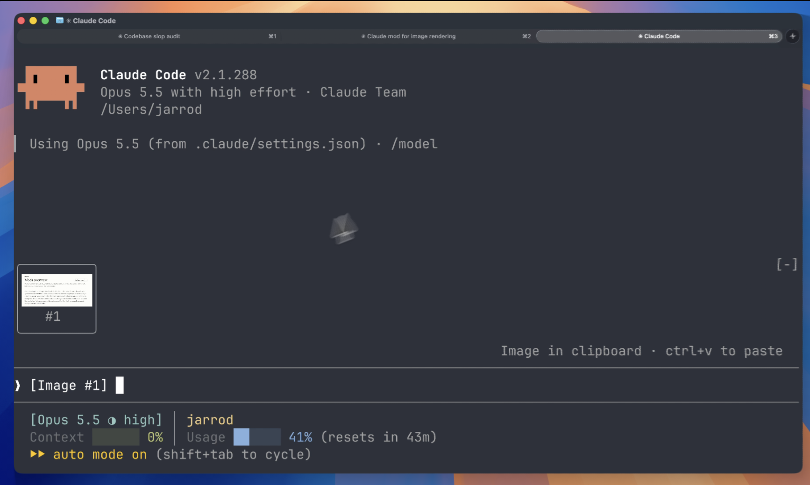

# Claude Image View

A Claude Code mod that shows the images you paste, so you see thumbnails above your prompt instead of bare `[Image #1]` tags.

> This is a fork of [jarrodwatts/claude-image-view](https://github.com/jarrodwatts/claude-image-view). It adds Windows support, a block-mosaic thumbnail for terminals without the kitty graphics protocol, and a button that opens the original. Upstream changes are merged here only after review, so install from this repository.

[](LICENSE)
[](https://github.com/jarrodwatts/claude-image-view/stargazers)



## Install

Inside Claude Code, run:

```
/plugin marketplace add KoichiroHatsuse/claude-image-view
/plugin install image-view
/reload-plugins
```

That's it. Paste an image into the prompt and its thumbnail appears above the input.

<details>
<summary><strong>Prefer the terminal?</strong></summary>

```bash
claude plugin marketplace add KoichiroHatsuse/claude-image-view
claude plugin install image-view@claude-image-view
```

Then run `/reload-plugins` inside a session, or start a new one.

</details>

## What You See

Paste one or more images and a row of thumbnails sits above the prompt, each labelled with the number of its tag:

```
╭────────────────────────╮ ╭────────────╮
│                        │ │            │
│      (screenshot)      │ │  (photo)   │
│                        │ │            │
│           #1           │ │     #2     │
╰────────────────────────╯ ╰────────────╯
❯ why is the header misaligned here [Image #1] vs [Image #2]
```

- **Thumbnails appear as soon as you paste.** You don't have to type another key first.
- **Thumbnails keep their shape.** Wide screenshots stay wide and phone shots stay tall.
- **Always fits on screen.** Tiles shrink to fit the space above the prompt, so the row never scrolls or gets cut off.
- **Clears on send.** Once the prompt is sent (or the tags are deleted), the row goes away.
- **Opens the original.** Click the `#1 open` label under a tile (or press `ctrl+x tab`, then the digit) to open the full image in your OS's viewer: Photos on Windows, Preview on macOS, `xdg-open` on Linux.

## How It Works

Claude Code saves every pasted image to a cache folder for the session, as `<tmp>/<project>/<session>/images/<n>.png` (`<tmp>` is `%TEMP%\claude` on Windows and `/tmp/claude-<uid>` elsewhere), and puts an `[Image #n]` tag in the prompt. Claude Image View is a [mod](https://code.claude.com/docs/en/plugins/mods/overview):

1. Every 200ms it reads the prompt box and looks for `[Image #n]` tags. It checks on a timer because pasting an image doesn't raise an edit event.
2. For each tag it finds the cached PNG and reads its size from the PNG header.
3. It draws the thumbnails in the band above the prompt:
   - **In Ghostty or kitty**, with Claude Code's `Image` element. The terminal reads the file itself and draws the real pixels.
   - **In every other terminal** (Windows Terminal, iTerm2, Terminal.app, VS Code's terminal, tmux), the mod decodes the PNG itself and draws it with the `Raster` element as a mosaic of quadrant blocks (`▀ ▐ ▚ ▟` …), four pixels a cell in two colours. It's coarse (text in a screenshot stays unreadable), so open the original to read it.

## Security

Claude Image View is local-only. It makes no network requests and writes no files. It reads the prompt box, lists Claude Code's temp folder to find the current session's image cache, and reads each pasted image. If neither `CLAUDE_CODE_TMPDIR` nor `TEMP` is set, it runs `id -u` once to find the default temp folder. Opening an original runs `explorer.exe`, `open` or `xdg-open` with the image's path (and `uname` once to tell macOS from Linux), never through a shell. The PNG decoder (`hooks/png.ts`) is plain TypeScript in this repo, with no dependencies.

Run `claude plugin validate` on the repo to see every event it hooks and every call it makes.

## Requirements

- Claude Code v2.1.287 or later (mods support)
- macOS, Linux or Windows
- For the real pixels, a terminal with the kitty graphics protocol, such as [Ghostty](https://ghostty.org) or [kitty](https://sw.kovidgoyal.net/kitty/). Other terminals get the block mosaic; it needs 24-bit colour to look right.

Pasted images over 4 MiB get no mosaic, since the mod can't read files that big. The Claude Desktop app already previews pasted images, so the mod draws nothing there.

## Troubleshooting

**Nothing appears when I paste.** Run `/plugin` and check the dim line under the tabs lists `image-view` as an active mod. If it isn't listed, run `/reload-plugins`.

**The tile says "no preview".** The mod couldn't find the cached file. Claude Code may have moved where it stores pasted images. Please [open an issue](https://github.com/KoichiroHatsuse/claude-image-view/issues) with your Claude Code version.

**The tile shows `[Image #1]` text instead of the picture.** The mod took your terminal for Ghostty or kitty (from `TERM` or `CLAUDE_CODE_FORCE_TERMINAL_IMAGES`), but it can't draw images. Unset whichever one is wrong to get the mosaic instead.

**The tile shows `[Image #1]` text in agent view or a background session, even in Ghostty or kitty.** Claude Code turns terminal images off for background sessions. If you attach from a terminal with the kitty graphics protocol, turn them back on in the `env` block of `~/.claude/settings.json`, then start a new session:

```json
"env": { "CLAUDE_CODE_FORCE_TERMINAL_IMAGES": "1" }
```

## Development

```bash
git clone https://github.com/KoichiroHatsuse/claude-image-view
cd claude-image-view

# Load it for one session without installing
claude --plugin-dir .

# Check it and run the tests
claude plugin validate .
claude plugin test .
```

Claude Code writes the API types into `.claude-plugin/types/` the first time it loads the mod, and `tsc -p .` type-checks it from then on.

## License

MIT. See [LICENSE](LICENSE).

## Star History

[](https://star-history.com/#jarrodwatts/claude-image-view&Date)
